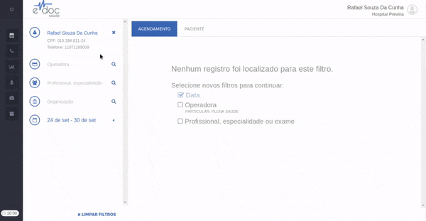

#  Cadastrar um Convênio

O registro de um novo convênio pode ser feito pelo [Cadastro Rápido](#cadastro_rapido) ou pelo [Cadastro Completo](#cadastro_completo).

##1. Cadastro Rápido {#cadastro_rapido}
O cadastro rápido é utilizado inserir rapidamente as informações minimas do convênio de um paciente e seguir para o agendamento. As informações mínimas são **Operadora, Número da Carteirinha e Nome de Paciente na Carteirinha**.

O cadastro rápido tem o seguinte passo a passo:

	

	<ul>
		<li>Clique no ícone de convênio</li>
		<li>Preencha Convênio, Número da Carteirinha e Nome do Paciente conforme escrito na carteirinha</li>
		<li>Clique em Salvar</li>
	</ul>

Depois de realizar o cadastro, basta buscar pelo nome do convênio registrado para selecioná-lo.

> **Possíveis Erros**
>  * Convênio não encontrado - a busca de convênios retorna apenas as operadoras de saúde que têm contrato com a sua instituição. Se um convênio não foi encontrado, ele não está registrado ou está com o contrato inválido. Entre em contato com o setor de cadastramento.
>  * Números de carteirinha sofrem diferentes validações dependendo do convênio. Qualquer mensagem de erro indicará claramente qual é o problema na digitação.

##2. Cadastro Completo {#cadastro_completo}
O cadastro completo recebe os mesmos campos do cadastro rápido, mas ele se localiza diretamente na ficha do paciente. É útil utilizado quando se está cadastrando um paciente via cadastro completo, podendo inserir as informações de convênio e salvar apenas uma vez.

O cadastro completo tem o seguinte passo a passo:

	

	<ul>
		<li>Selecione o paciente desejado para registrar o convênio.</li>
		<li>Navegue até o fim da página de RESUMO e insura as informações do convênio.</li>
		<li>Clique em Adicionar.</li>
		<li>Clique em Salvar.</li>
	</ul>

