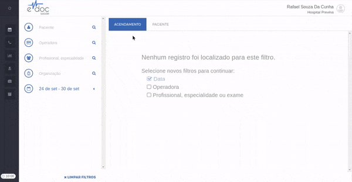

#  Cadastrar um Paciente

O registro de um novo paciente pode ser feito pelo [Cadastro Rápido](#cadastro_rapido) ou pelo [Cadastro Completo](#cadastro_completo).

##1. Cadastro Rápido {#cadastro_rapido}
O cadastro rápido é utilizado inserir rapidamente as informações minimas de um paciente e seguir para o agendamento. As informações mínimas são **Nome Completo, CPF e pelo menos um Telefone**.

O cadastro rápido tem o seguinte passo a passo:

	

	<ul>
		<li>Clique no ícone de paciente</li>
		<li>Preencha Nome Completo, CPF válido e pelo menos um Telefone</li>
		<li>Clique em Salvar</li>
	</ul>

O cadastro rápido seleciona automaticamente o convênio "Particular" para o paciente. Se o agendamento não for particular, você deve [cadastrar um convênio](cadastrar_convenio.md)

> **Possíveis Erros**
>  * Se o paciente for dependente (ou seja, não possuir CPF), deve-se utilizar o [cadastro completo](#cadastro_completo).
>  * CPFs são validados por dígito verificador. Caso o CPF seja inválido, o eDoc devolverá erro e não realizará o cadastro. **Valide o numero de CPF informado pelo paciente**.
>  * Não é possível registrar mais de um paciente com o mesmo CPF. Esse registro retorna a mensagem "CPF já está sendo usado". **Busque o CPF que já está sendo utilizado e corrija o cadastro que está incorreto**.
>  * Números de telefone também têm o formato validado. Formatos inválidos retornam erro e não realizam o cadastro.

##2. Cadastro Completo {#cadastro_completo}
O cadastro completo é utilizado para inserir outras informações relevantes do paciente, como endereço, email, etc. Também é utilizado para informar que um paciente é dependente, além dos dados de registro do responsável.

O cadastro completo tem o seguinte passo a passo:

	

	<ul>
		<li>Sem nenhum paciente selecionado, clique a aba "PACIENTE".</li>
		<li>Insira os dados que quiser nas abas resumo, cadastro ou dados complementares.</li>
		<li>Clique em Salvar</li>
	</ul>

<!-- 
* Sem nenhum paciente selecionado, clique a aba "PACIENTE".
* Insira os dados que quiser nas abas resumo, cadastro ou dados complementares.
* Clique em Salvar
 -->

> **Possíveis Erros**
>  * As mesmas validações do cadastro rápido são aplicadas (CPF válido e único, ao menos um telefone válido).
>  * Outros dados, se inseridos, também passarão por validação. Por exemplo, e-mail deve ter formato válido e também deve ser único. A mensagem de erro indica exatamente qual dado não passou na validação.