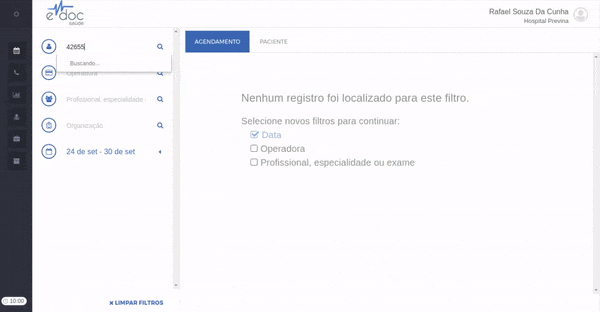

#  Editar Paciente e Convênio

Para editar os dados de [cadastro de um paciente](#editar_paciente), ou os [convênios](#editar_convenio) que o mesmo tem cadastrado, basta selecionar o usuário e utilizar a aba de "PACIENTE" para editar e salvar os dados.
Os dados de convênio fazem parte do perfil do paciente, onde é possível adicionar e remover quantos convênios forem necessários.

##1. Editar Paciente {#editar_paciente}

A edição dos dados de um paciente tem o seguinte passo a passo:

	

	<ul>
		<li>Encontre e selecione um paciente</li>
		<li>Clique na aba "PACIENTE"</li>
		<li>Edite os dados que quiser nas abas "RESUMO", "CADASTRO" ou "DADOS COMPLEMENTARES"</li>
		<li>Clique em Salvar</li>
	</ul>

> **Possíveis Erros**  
>  Erros de validação do cadastro do usuário. Verificar sessão de Cadastro de paciente para documentação das principais validações.

##2. Editar Convênios {#editar_convenio}
A adição e remoção de convênios de um paciente pode ser feita na aba de Resumo ou de Cadastro.

Deve-se notar que um paciente pode ter quantos convênios forem necessários no mesmo perfil. Portanto, mais de um convênio pode ser [adicionado](#adicionar_convenio), [editado](#editar_convenio) ou [removido](#remover_convenio).

### 2.1 Adicionar mais de um convênio {#adicionar_convenio}

	

	<ul>
		<li>Encontre e selecione um paciente</li>
		<li>Clique na aba "PACIENTE"</li>
		<li>Inclua os dados de convênio e clique em Adicionar</li>
		<li>Clique em Salvar</li>
	</ul>

### 2.2 Editar um convênio {#editar_convenio}

	 

	<ul>
		<li>Encontre e selecione um paciente</li>
		<li>Clique na aba "PACIENTE"</li>
		<li>Clique no botão de edição (lápis) do convênio que deseja alterar</li>
		<li>Altere os dados necessários e clique em Adicionar</li>
		<li>Clique em Salvar</li>
	</ul>

### 2.3 Remover um convênio {#remover_convenio}

	

	<ul>
		<li>Encontre e selecione um paciente</li>
		<li>Clique na aba "PACIENTE"</li>
		<li>Clique no botão de excluir (lixeira) do convênio que deseja remover</li>
		<li>Clique em Salvar</li>
	</ul>

