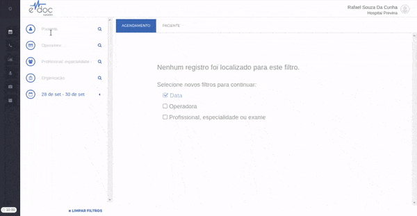
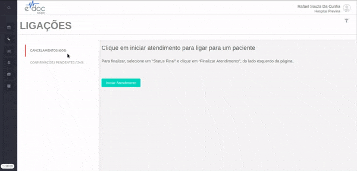
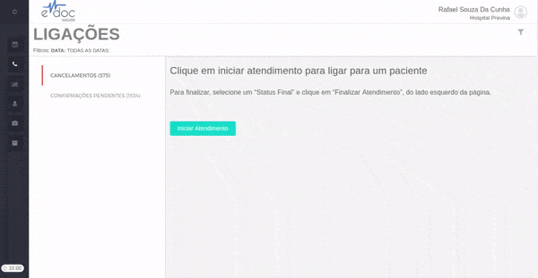
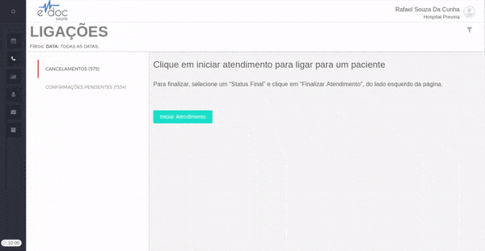
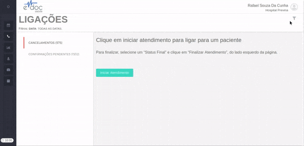
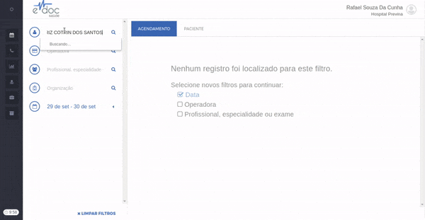

#  Ligações Ativas

A tela de ligações ativas mostra todos os contatos que devem ser feitos pelos operadores de call center para informar o paciente de um **cancelamento de consulta** ou para **confirmar a presença** do paciente em uma consulta já agendada.

Nesta sessão você aprenderá a:
1. [Acessar a tela de ligações ativas](#acessar_ligacoes_ativas)
2. [Escolher uma fila para iniciar o atendimento](#escolher_fila)
3. [Realizar uma ligação](#realizar_ligacao)
4. [Filtrar uma fila de atendimento](#filtrar_fila)
5. [Descobrir se há uma ligação ativa para um paciente específico](#paciente_ativo)

##1. Acessar a tela de ligações ativas {#acessar_ligacoes_ativas}
A tela de ligações ativas é representada pelo simbolo de um telefone no menu lateral esquerdo. Você também pode pausar o mouse em cima do botão, ou extender o menu lateral esquerdo para ver a tela de "ligações".

	

##2. Escolher fila para atendimento {#escolher_fila}
As filas de atendimento aparecem listadas no lado esquerdo da tela de ligações ativas. A primeira fila de atendimento já vem selecionada quando acessamos a tela.
Para mudar de fila, clique no nome da fila.
Para ver qual fila está selecionada, veja a posição do marcador vermelho do lado esquerdo do nome das filas.

	

> **Importante**  
> Vale notar que ao lado do nome de cada uma das filas (no exemplo, "Cancelamento" e "Confirmações Pendentes") há o número de ligações a ser feitas que estão na fila.
Ou seja, se ao lado da fila de cancelamento houver o número 100, isso significa que existem cem agendamentos cancelados com os quais precisamos entrar em contato para avisar os pacientes sobre o cancelamento.

##3. Realizar uma ligação {#realizar_ligacao}
Para realizar uma ligação, clique no botão Iniciar Atendimento.
Essa ação vai mostrar as informações deste atendimento para a atendente.

> **Importante**  
> * Ao clicar em iniciar, o eDoc pegará o primeiro item da fila e entregará para o atendente. Isso significa que nenhum outro atendente conseguirá pegar o mesmo atendimento enquanto ele estiver em andamento por quem iniciou primeiro.
> * A fila de atendimentos é ordenada por prioridade - os agendamentos mais próximos são os primeiros da fila, enquanto os mais distantates são os últimos.

A tela mostra as as seguintes informações:
 * Dados pessoais do paciente - **nome** e **telefones de contato** 
 * Informações do atendimento - **data agendada**, **hora agendada**, **Status do agendameto** (Marcado, confirmado ou cancelado) e **contatos realizados** (número de vezes que uma atendente entrou em contato sem sucesso)
 * Motivo - motivo de realização da ligação. Em geral, é a razão para o cancelamento de uma consulta.
 * Profissional - Nome do profissional que o procedimento foi agendado
 * Especialidade - Especialidade do profissional que o procedimento foi agendado
 * Procedimento - Nome do procedimento agendado
 * Organização - Unidade do hospital onde o procedimento foi agendado

No lado direito, também é mostrado o agendamento, com todos os [detalhes de ações](buscar_agendamento.md#detalhes_acoes) que foram realizados. Podem ser exibidos, por exemplo: data e horário do agendamento, profissional que realizou o agendamento, informações de SMS enviados para o paciente, etc.

De dentro da tela de atendimento, é possível fazer duas principais ações: [concluir o atendimento](#concluir_atendimento) ou [sair do atendimento](#sair_atendimento).

###3.1 Concluir o atendimento {#concluir_atendimento}

	

	<ul>
		<li>Inicie um atendimento</li>
		<li>Ligue para o paciente e faça a comunicação</li>
		<li>Marque se o paciente atendeu ou não</li>
		<li>Insira um comentário (opcional)*</li>
	</ul>

*Comentários são inseridos para referências importantes no futuro. Por exemplo, "recado foi deixado com a mãe do paciente".

Também é possível enviar um SMS para o paciente, especialmente se o mesmo não atender. Para tanto, basta clicar em "Enviar SMS" que a mensagem padrão de cancelamento ou de confirmação da sua organização será enviada para o paciente.

Caso o paciente **tenha atendido**, o clique em "Concluir Atendimento" removerá o paciente da fila e nenhum outro contato será realizado com o mesmo. Caso o paciente **não tenha atendido**, ele será colocado no fim da fila, o o outros atendentes terão a oportunidade de tentar entrar em contato novamente.

###3.2 Sair do atendimento {#sair_atendimento}
Essa função é util quando um atendimento foi iniciado por engano e é necessário sair do mesmo, mantendo este atendimento como o primeiro da fila. 

	

Para sair sem alterar a posição de uma ligação na fila, clique no "x" no canto superior direito da tela.

##4. Filtrar uma fila de atendimento {#filtrar_fila}
Para customizar a ordem de prioridade que as ligações aparecem para serem feitas, pode-se filtrar as filas de ligações.
Por exemplo, pode ser estratégia de um centro médico dar prioridade às confirmações de presença de apenas uma de suas unidades. 

Para filtrar as filas de atendimento, siga o passo a passo:

	

	<ul>
		<li>Clique no filro no canto superior direito</li>
		<li>Selecione os campos que deseja fitrar (data, organização, profissional, operadora ou paciente</li>
		<li>Clique em filtrar</li>
		<li>Inicie um atendimento</li>
	</ul>

##5. Descobrir se há uma ligação ativa para um paciente específico {#paciente_ativo}
Imagine o seguinte cenário:
Um paciente liga para agendar uma consulta, mas esse mesmo paciente está na fila de ligações ativas, aguardando que um atendente entre em contato para informar que outra consulta foi cancelada. 
Não seria mais fácil aproveitar que o paciente já está na linha, informá-lo do cancelamento da consulta e removê-lo da fila de ligações ativas?

Para saber se um paciente tem alguma ligação ativa pendente, basta selecioná-lo na tela de agendamento. Se houver alguma ligação pendente, o eDoc abrirá automaticamente uma versão resumida da tela de ligações ativas para que o paciente possa ser comunicado da pendência. Ao fim da comunicação, basta retirá-lo da fila.

	

