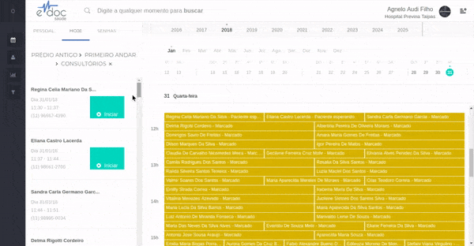

#  Cadastro de CID

O cadastro do CID-10 (Código Internacional de Doenças) é o único dado **obrigatório** em um atendimento non eDoc.
Sem ele, nao será possível finalizar uma sessão de atendimento.

	

	<ul>
		<li>Busque o CID desejado por nome ou código da doença</li>
		<li>Para trocar o CID, clique no "x" ao lado do nome selecionado</li>
	</ul>

 

