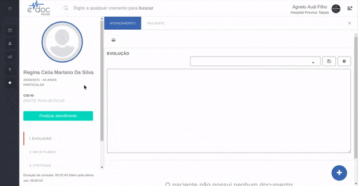
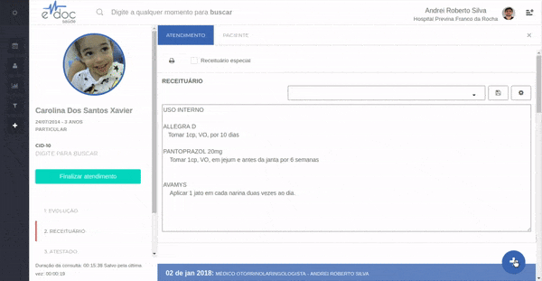

#  Documentos Padrão

Fornecemos 3 documentos padrão básicos - Evolução, Receituário e Atestado.
Dependendo das configurações da sua unidade, mais documentos podem fazer parte do seu atendimento.

	

	<ul>
		<li>Documentos ficam no canto inferior esquedo da tela</li>
		<li>Para navegar entre eles, clique em cima do nome</li>
		<li>Não é necessário salvar o atendimento quando navegar entre documentos - os dados não serão perdidos</li>
	</ul>

 

É possível adicionar mais de um documento do mesmo tipo - por exemplo, deseja-se fazer duas receitas diferentes para o mesmo atendimento do paciente. 
Clique no botão de "+" no canto inferior direito da tela de atendendimento.

	

	<ul>
		<li>Clique no botão de "+" para adicionar um documento</li>
		<li>Um novo formulário do documento será inserido no topo da página</li>
		<li>Prossiga o atendimento normalmente</li>
	</ul>

 

