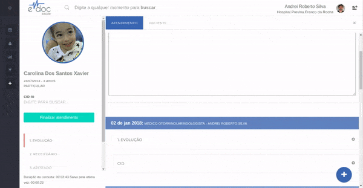

#  Histórico do Paciente

Caso o paciente tenha passado em consultas registradas no eDoc, seu histórico de saúde ficará registrado na tela de atendimento.

Ao rolar a tela para baixo, o profissional pode verificar todos os documentos registrados no perfil do paciente.

	

	<ul>
		<li>Arraste a tela para baixo para ver os histórico do paciente</li>
		<li>Clique sobre o tipo de documento para expandir e ler o texto inserido no histórico</li>
	</ul>

 

