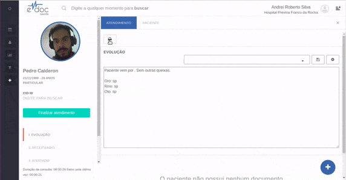
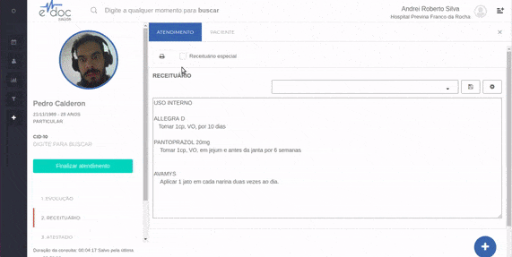
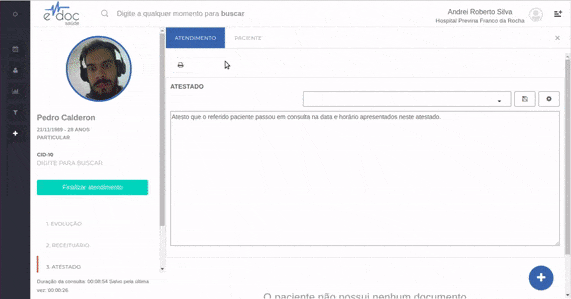

#  Impressão de documentos

Todos os documentos podem ser impressos a qualquer momento ao clicar no botão de impressão.
Todas as impressões levam o nome e o logo da instituição, nome e conselho do profissional, endereço e data do atendimento.
Apesar disso, cada documento tem uma peculiaridade em sua impressão.

A peculiaridade de cada documento pode ser conferida nos seguintes links:
* [Evolução](#evolucao)
* [Receituário](#receituario)
* [Atestado](#atestado)

##1- Evolução {#evolucao}

	

	
A evolução é impressa com o nome do paciente e os dados de texto que nela foram inseridos. Não há mais nenhum tipo de automação.

	<!-- <ul>
		<li>Insira o texto que deseja salvar para reutilização</li>
		<li>Clique no botão de salvar texto</li>
		<li>Insira o título do texto e salve</li>
	</ul> -->

 

##2- Receituário {#receituario}

	

	
Os receituários permitem a impressão normal e receituário especial. Basta selecionar o receituário especial para que o formato do receituário seja alterado e para que a impressão já seja feita em duas vias.
 

 

 

##3- Atestado {#atestado}

	

Além do texto inserido, o atestado imprime o Nome do Paciente, a data e hora em que a consulta foi agendada, a data e hora em que a consulta foi iniciada e um identificador único do documento de atestado. Qualquer pessoa que receba esse atestado pode entrar em , inserir o código único e ver os dados de atestados que foram registrados em sistema. Ao comparar os dados da tela com os dados do atestado em papel, é possível verificar se o documento apresentado foi adulterado.

	

 

