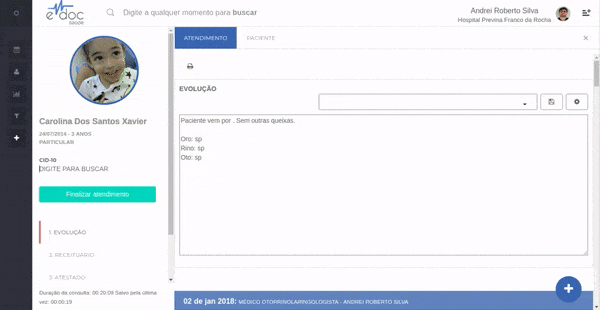

#  Finalizar e Reiniciar Atendimento

Para finalizar um atendimento, insira um CID e clique em "Finalizar Atendimento"
Para reiniciar um atendimento, encontre o atendimento no calendário e clique em iniciar sessão

> **Importante**
> * Ao reiniciar um atendimento, será impossível alterar o histórico da sessão passada. É possível somente incluir novos documentos no mesmo atendimento.

	

	<ul>
		<li>Insira um CID e clique em Finalizar Atendimento para concluir </li>
		<li>Para reiniciar, clique no atendimento no calendário e em Iniciar sessão</li>
		<li>Documentos de uma sessão reiniciada serão inserido ao atendimento. É impossível alterar o histórico</li>
	</ul>

 

