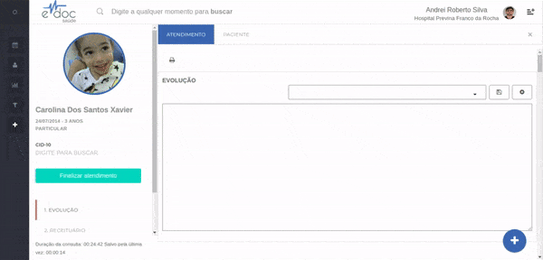

#  Sair sem finalizar atendimento

Após iniciar um atendimento, é possível sair sem finalizar o mesmo.
Essa situação é comum quando um profissional abre um atendimento por engano e não deseja salvar um dado que será inalterável.

> **Importante**
> * Ao sair sem salvar o atendimento, tudo o que foi escrito nos documentos desta sessão será apagado. Ou seja, se você já digitou alguma informação, essa informação será perdida.

	

	<ul>
		<li>Clique no "x" no canto superior direito da tela de atendimento</li>
		<li>Confirme que aceita perder todos os dados inseridos até o momento no atendimento</li>
	</ul>

 

