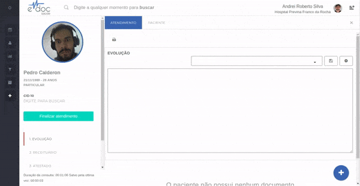
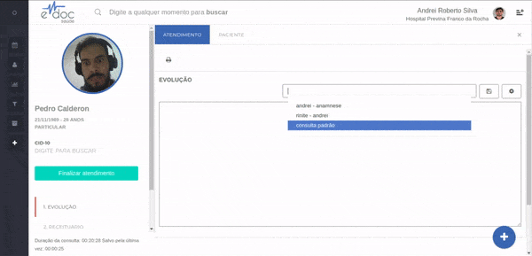
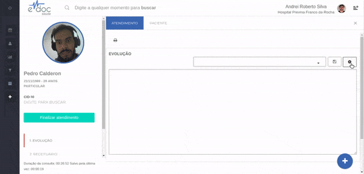

#  Textos Padrão

Dentro de cada documento existe a possibilidade de salvar quantos textos padrão forem necessários.

Os textos padrão são textos de inserção rápida, que garantem uma boa documentação do atendimento sem que o profissional de saúde perca muito tempo realizando essa documentação.

As principais ações de texto padrão são:
* [Criar um texto padrão](#criacao_texto)
* [Selecionar um texto padrão](#selecionar_texto)
* [Editar um texto padrão](#editar_texto)
* [Remover um texto padrão](#remover_texto)

##1- Criar um texto padrão {#criacao_texto}

	

	<ul>
		<li>Insira o texto que deseja salvar para reutilização</li>
		<li>Clique no botão de salvar texto</li>
		<li>Insira o título do texto e salve</li>
	</ul>

 

> **Atenção**
> * Todo o texto que estiver na caixa de texto será salvo sob o título inserido. Caso queira salvar apenas parte de um texto, primeiro escreva apenas a parte que deseja salvar, finalize a criação do texto padrão e depois complemente com a parte que não será salva

##2- Selecionar um texto padrão {#selecionar_texto}

	

	<ul>
		<li>Clique na lista de textos salvos</li>
		<li>Busque o texto desejado</li>
		<li>Clique sobre o título do texto na lista para inseri-lo abaixo do texto existente</li>
	</ul>

 

 

##3- Editar um texto padrão {#editar_texto}

	

	<ul>
		<li>Clique sobre o botão de configurações de texto padrão</li>
		<li>Selecione o texto que deseja editar no topo da aba de edição</li>
		<li>Edite à vontade</li>
		<li>Salve as novas configurações</li>
	</ul>

 

##4- Remover um texto padrão {#remover_texto}

	

 
	<ul>
		<li>Clique sobre o botão de configurações de texto padrão</li>
		<li>Selecione o texto que deseja editar no topo da aba de edição</li>
		<li>Clique no botão de excluir texto</li>
		<li>Confirme a exclusão permanente do texto</li>
	</ul>

 

