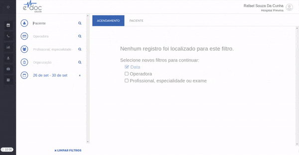
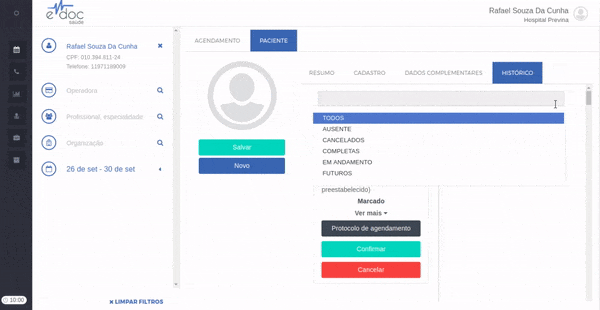

#  Buscar Agendamento

Depois que um agendamento é feito, ele fica registrado no perfil do paciente, na aba de histórico.

Você pode [navegar até o agendamento](#navegar_agendamento), [filtrar agendamentos](#filtrar_agendamentos) e ver [detalhes dos agendamentos](#detalhes_agendamento) feitos.

## 1. Encontrando agendamento {#navegar_agendamento}

	

	<ul>
		<li>Encontre e selecione um paciente</li>
		<li>Clique na aba "PACIENTE"</li>
		<li>Clique na aba "HISTÓRICO"</li>
		<li>Navegue até o agendamento desejado</li>
	</ul>

## 2. Filtrar agendamentos {#filtrar_agendamentos}

	

É possível filtrar agendamentos por status, ou seja, ver apenas os agendamentos futuros, ou os que foram cancelados. Basta selecionar o status desejado na lista no topo da página de histórico do paciente.

## 3. Detalhes do agendamento {#detalhes_agendamento}

As informações do agendamento estão disponíveis em dois tipos de detalhamento - o protocolo de agendamento e os detalhes de açóes.

### 3.1 Protocolo de agendamento {#protocolo_agendamento}

Os protocolos de agendamentos mostras as informações definidas quando um agendamento foi feito, como data, horário, convênio, profissional e unidade. O protocolo é mostrado em um arquivo PDF, tornando fácil a sua impressão ou envio.

	

Navegue até o agendamento que deseja obter mais detalhes e clique no botão de "Protocolo de Agendamento" para gerar o PDF com as informações.

### 3.2 Detalhes de ações {#detalhes_acoes}

Os detalhes de ações mostram as ações de todos os usuários que interagiram com o agendamento em ordem temporal. Em um agendamento comum, os detalhes de ações mostrarão quem criou o agendamento, mensagens de confirmação enviadas, resposta das mensagens enviadas, profissional que recepcionou o paciente, profissional que atendeu o paciente e profissionais que fizeram a cobrança deste atendimento.

	

Navegue até o agendamento que deseja obter os detalhes de ações e clique no botão "Ver mais" para ver em ordem cronológica as interações realizadas com este agendamento.

