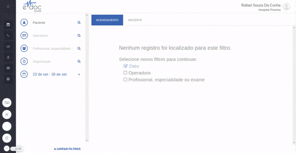
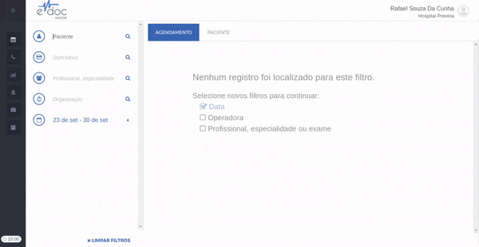

#  Buscar Paciente

Todos os pacientes cadastrados no eDoc têm, necessariamente, um CPF único registrado no sistema.
Assim sendo, a melhor maneira de encontrar um paciente é buscá-lo pelo CPF.

###1. Encontrando um paciente

	

A caixa de busca de pacientes permite procurar por **Nome** ou **CPF** do paciente. A partir de 3 caracteres digitados a busca é iniciada e retorna com os 5 primeiros resultados encontrados. Para refinar a busca, basta continuar digitando.

###2. Paciente sem CPF

	

Em geral, crianças se apresentam sem CPF para consulta e são registradas com o CPF do responsável. Nesse caso, ao buscar o CPF do responsável, a busca retorna o perfil do **Responsável** e de seus **Dependentes**.

###3. Paciente não encontrado

Se a busca por CPF e por nome não retornar nenhum resultado, será necessário [cadastrar o paciente](cadastrar_paciente.md)
