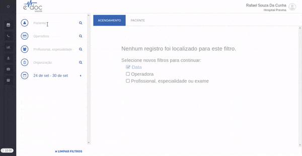

#  Criar um agendamento

Para criar um agendamento, basta ao operador de call center seguir os seguintes passos:

	

	<ul>
		<li><a href="#selecionar_paciente">Selecionar um paciente</a></li>
		<li><a href="#selecionar_convenio">Selecionar um convênio</a></li>
		<li><a href="#selecionar_profissional">Selecionar profissional ou especialidade</a></li>
		<li><a href="#selecionar_procedimento">Selecionar um procedimento (opcional)</a></li>
		<li><a href="#selecionar_organizacao">Selecionar uma organização (opcional)</a></li>
		<li><a href="#escolher_local">Escolher data e local</a></li>
		<li><a href="#escolher_horario">Escolher horário</a></li>
		<li><a href="#salvar_agendamento">Salvar agendamento</a></li>
	</ul>

O lado direito da tela de agendamento mostra os dados mínimos que devem ser selecionados para retornar uma busca. Caso não encontre nenhum resultado, certifique-se que todos dos dados necessários estão selecionados.

> **Importante**  
> Todos os campos de busca na página de agendamento são **interdependentes**.  
> **Exemplo 1**: Se um convênio estiver selecionado, os resultados das buscas por profissional, especialidade e organização retornarão apenas resultados que podem ser agendados por este convênio.  
> **Exemplo 2**: Se um profissional estiver selecionado, a busca de procedimentos retornará apenas os procedimentos realizados por este profissional.

##Passo a Passo

###1. Selecionar um paciente {#selecionar_paciente}
A [busca de pacientes](./buscar_paciente.md) é feita por **CPF** ou por **Nome**. Caso nenhum paciente seja encontrado, será necessário [cadastrar o paciente](./cadastrar_paciente.md).

###2. Selecionar um convênio {#selecionar_convenio}
A busca de convênios inicia a partir da digitação de 3 caracteres.

Se o paciente não tiver nenhum convênio cadastrado, o convênio "Particular" é selecionado automaticamente.

> **Importante**  
> A busca de convênios retorna **apenas convênios cadastrados no perfil do paciente**. Se o convênio do paciente não for encontrado, será necessário [cadastrar um novo convênio para o paciente](./cadastrar_convenio.md) 

###3. Selecionar um profissional ou especialidade {#selecionar_profissional}
A busca de profissionais ou de especialidades inicia a partir da digitação de 3 caracteres.

Caso um profissional seja selecionado, será necessário selecionar a especialidade do mesmo.
Se o profissional tiver apenas uma especialiade, ela será selecionada automaticamente. Caso contrário, deve-se escolher uma das especialidades disponíveis para seguir em frente.

> **Possíveis Erros**  
> **Não encontrar um profissional / especialidade**: nenhum resultado será retornado para a busca caso (a) não haja nenhum contrato válido para a busca ou (b) os outros filtros excluem a possibilidade de se encontrar um resultado para a busca (ex: convênio Bradesco está selecionado e buscamos por Fisioterapia, mas não estamos convêniados para atender essa especialidade por esse convênio).

###4. Selecionar um procedimento {#selecionar_procedimento}
O campo de busca de procedimentos aparece a partir do momento que um profissional / especialidade é selecionado.
Se há apenas um procedimento possível para agendamento (ex: consulta ambulatorial), este procedimento será selecionado automaticamente.
Se há mais de um procedimento possível, será necessário buscar e selecionar o procedimento para agendamento.
A busca por procedimentos pode ser feita por **Nome do procedimento** ou por **Código TUSS** fornecido na senha de autorização do mesmo.

> **Possíveis Erros**  
> **Não encontrar um procedimento**: nenhum resultado será retornado para a busca caso (a) não haja nenhum contrato válido para os profissionais realizarem o procedimento ou (b) os outros filtros excluem a possibilidade de se encontrar um resultado para a busca (ex: Se um convênio estiver selecionado, não será possível encontrar o procedimento Escleroterapia para Médicos Vasculares, já que convênios não cobrem este procedimento. Se o convênio selecionado for Particular, será possível encontrar este procedimento).

###5. Selecionar uma organização {#selecionar_organizacao}
Se necessário, pode-se buscar e selecionar apenas uma organização para filtrar a busca.
Caso nenhuma organização seja selecionada, os horários disponíveis serão buscados em todas as organizações pertencentes ao mesmo grupo.

###6. Escolher data e local {#escolher_local}
Quando os dados mínimos estiverem selecionados, a página retornará datas e locais em que há vagas disponíveis.
Todos os filtros opcionais farão a página recarregar e trazer apenas resultados possíveis para agendamento.

> **Possíveis Erros**  
> **Não encontramos nenhum horário disponível para a sua busca**: Todos os horários do profissional estão ocupados para a busca que está sendo feita. Altere os parâmetros da busca (ex: data) ou entre em contato com o gestor de agendas da sua instituição para avaliar a possibilidade de abertura de mais horários.

###7. Escolher horário  {#escolher_horario}

Após a seleção de data e local, a próxima página mostra todos os profissionais e horários disponíveis para aquele dia.

> **Possíveis Erros**  
> **Horário já ocupado**: caso a página com horários disponíveis fique aberta por muito tempo e outro operador (ou o paciente, via agendamento web) agende uma consulta em um horário, quando o operador clicar no mesmo horário o erro de "horário ocupado" será retornado. A página será recarregada para a seleção de um outro horário disponível.

###8. Salvar Agendamento {#salvar_agendamento}
Após a seleção de um horário, a próxima página mostra um resumo das informações de agendamento. 
Há 3 botões disponíveis para finalmente salvar e confirmar um agendamento:

* **Salvar e manter filtros**: Salva o agendamento e mantém todos os dados de paciente, convênio, profissional, procedimento e organização selecionados. Útil para o agendamento de diversas sessões com o mesmo profissional. (Ex: agendar 10 sessões de fisioterapia em sequência) 
* **Salvar e manter paciente**: Salva o agendamento e mantém apenas as informações de paciente e convênio selecionadas. Útil para o agendamento de diversas consultas diferentes para o mesmo paciente (Ex: agendar cardiologista e neurologista para o mesmo paciente).
* **Salvar e apagar filtros**: Salva o agendamento e limpa todos os filtros para aguardar a próxima ligação de outro paciente.