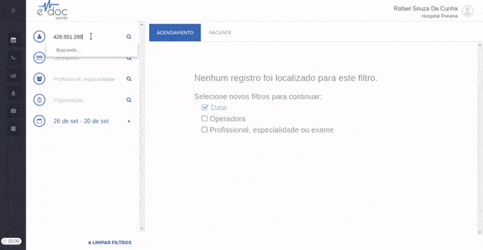

#  Editar e Cancelar um Agendamento

Os agendamentos no eDoc são ineditáveis, ou seja, depois de feitos não podem mais ser alterados e ficarão para sempre no histórico do paciente.

Caso seja necessário alterar um agendamento, deve-se **cancelar o agendamento que se deseja alterar** e realizar um novo agendamento para o paciente.

## Cancelar um agendamento {#cancelar_agendamento}

	

	<ul style="letter-spacing: -1px">
		<li>Encontre e selecione um paciente</li>
		<li>Clique na aba "PACIENTE"</li>
		<li>Clique na aba "HISTÓRICO"</li>
		<li>Navegue até o agendamento desejado</li>
		<li>Clique em cancelar</li>
		<li>Confirme o cancelamento</li>
		<li>Informe se deseja colocar o paciente na lista de ligações ativas*</li>
	</ul>

*A lista de ligações ativas é uma lista automática que mostra aos operadores de call center quais pacientes devem ser contatados para serem informados de alteração dos seus agendamentos. Para mais detalhes, acesse a [documentação](ligacoes_ativas.md) dessa funcionalidade.

