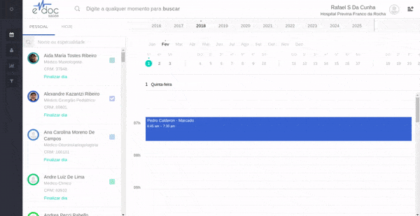

#  Realizar um encaixe

É possível encaixar um paciente a qualquer momento a partir da tela de calendário do eDoc.

Para tanto, selecione o profissional, dê dois cliques no calendário e preencha os dados do paciente e do procedimento a ser realizado.

	

	<ul>
		<li>Selecione o profissional</li>
		<li>Dê dois cliques em qualquer lugar vago no calendário</li>
		<li>Busque e selecione o paciente (se não encontrar um perfil de paciente, será necessário <a href="../paciente/cadatro.md">cadastrá-lo</a></li>
		<li>Selecione um convênio (só aparecerão convênios cadastrados para o paciente e profissional)</li>
		<li>Selecione o procedimento e a data</li>
	</ul>

 

