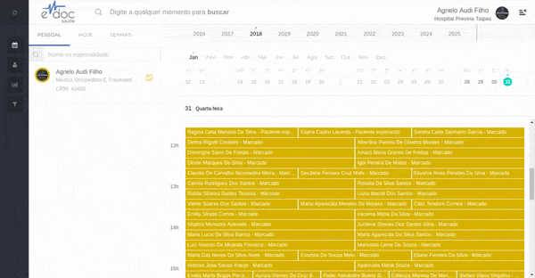

#  Sala de Espera

A aba HOJE, mostra todos os atendimentos do dia do profissional, em ordem de chegada dos pacientes.
Assim que um paciente tem a recepção finalizada, ele vai para cima na fila, e o profissiona vê o botão verde de Iniciar, para iniciar o atendimento do paciente.
Caso a unidade utilize o sistema de senhas do eDoc, o usuário verá dois botões: o de Iniciar e o de Chamar. O botão de chamar irá mostrar senha, nome do paciente e o número do consultório para o qual ele deve se dirigir nas televisões da recepção.

	

	<ul>
		<li>Selecione o profissioal desejado na aba PESSOAL</li>
		<li>Clique na aba HOJE</li>
		<li>Veja os pacientes em ordem de atendiento</li>
		<li>No topo, com botão iniciar, pacientes que já estão com a recepção feita</li>
	</ul>

 

