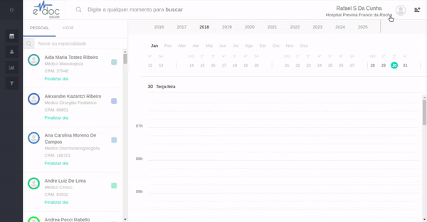

#  Selecionar unidade de atendimento

Para realização de recepções e atendimentos no eDoc, é necessário estar na unidade correta.
Para tanto, basta acessar o menu que mostra todas as unidades às quais vocẽ tem acesso:

	

	<ul>
		<li>Clique acima do seu nome no canto superior direito</li>
		<li>Selecione a unidade desejada da lista de unidades</	li>
		<li>Também é possível selecionar abrir esta documentação</li>
		<li>Clicar em Sair faz o logout da plataforma</li>
	</ul>

 

##Principais Dúvidas

###1. Não encontro uma unidade à qual deveria ter acesso

O acesso às unidade é dado por quem abre as agendas de cada profissional na plataforma de controle de grupos. Entre em contato com o responsável pelo cadastro de profissionais e abertura de agendas da sua organização para garantir que estes cadastros estão corretos. Após qualquer alteração, saia e entre novamente no eDoc para checar as alterações.  

