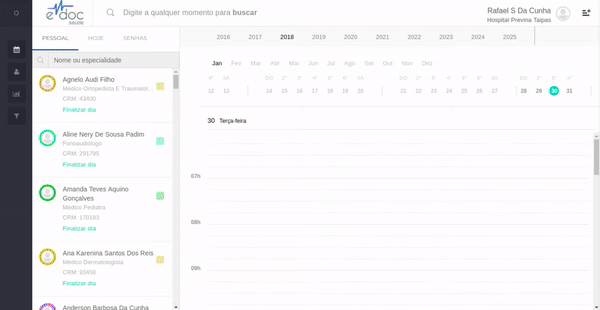

#  Visualizar agenda de um profissional

Ao selecionar a aba de PESSOAL, no canto superior esquerdo da tela, é mostrada a lista de profissionais aos quias você tem acesso à agenda dentro desta unidade.

Para visualizar os agendamentos do dia deste profissional, basta encontrar o profissional desejado e selecionálo:

	

	<ul>
		<li>Busque o profissional por nome ou especialidade</li>
		<li>Selecione o checkbox ao lado do nome do profissional</	li>
		<li>A agenda do dia será mostrada no calendário, do lado direito da tela</li>
		<li>É possível ver detalhes de cada agendamento <a href="#clique_agendamento">clicando em cima</a> do mesmo ou através da <a href="#busca_global">busca global</a></li>
	</ul>

 

##Detalhes de um agendamento

###1. Clicar em um agendamento  {#clique_agendamento}

	 

Ao clicar em cima de um agendamento, uma aba é aberta automaticamente com os detalhes do mesmo, além das opções de alterar o convênio, especialidade, horário agendado e botões para cancelar o evento ou iniciar a sua recepção.  

###2. Busca Global {#busca_global}

	 

Também é possível abrir a aba de detalhes do agendamento pela busca global. Basta buscar o nome ou o CPF do paciente para que todos os eventos agendados para o mesmo apareçam do lado esquerdo da tela, e todos os perfis de paciente apareçam do lado direito. Ao clicar sobre um evento, a mesmo aba de detalhes é mostrada.

